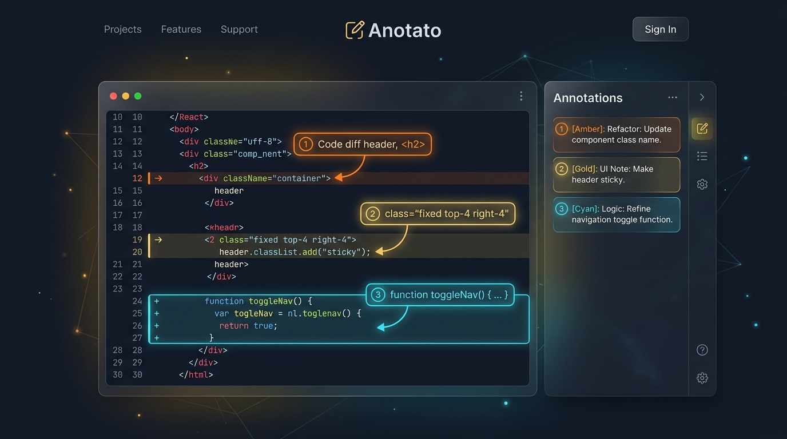

<div align="center">



# Annot8 📝⚡

**Screenshot Annotation & Split-View Markdown Note-Taking for Developers & Technical Writers**

*Ultra-fast, zero-friction canvas annotations with synchronized sequential numbered badges, rich markdown notes, and 1:1 pixel-perfect composite clipboard export.*

[](LICENSE)
[](https://www.typescriptlang.org/)
[](https://react.dev/)
[](https://tailwindcss.com/)
[-brightgreen?logo=vitest&logoColor=white&style=flat-square)](tests/)
[](.github/workflows/deploy-pages.yml)

</div>

---

> [!IMPORTANT]
> ### ⚠️ Mandatory Open-Source & Non-Affiliation Disclaimer
> **Annot8 is an independent, personal open-source project created and maintained by Prashanth Subrahmanyam. It is not an official Google project or product, and is not supported, certified, or endorsed by Google LLC in any capacity. This software is provided strictly on an 'AS IS' BASIS, WITHOUT WARRANTIES OR CONDITIONS OF ANY KIND, either express or implied, including, without limitation, any warranties or conditions of TITLE, NON-INFRINGEMENT, MERCHANTABILITY, or FITNESS FOR A PARTICULAR PURPOSE. Use at your own risk.**

---

## 📖 Table of Contents

- [Overview & Vision](#-overview--vision)
- [Key Features](#-key-features)
- [System Architecture](#-system-architecture)
- [Comprehensive Keyboard Shortcuts](#-comprehensive-keyboard-shortcuts)
- [Install as an App](#-install-as-an-app)
- [Getting Started & Local Development](#-getting-started--local-development)
- [Testing & Quality Assurance](#-testing--quality-assurance)
- [Production Deployment](#-production-deployment)
- [Contributing](#-contributing)
- [License](#-license)

---

## 🌟 Overview & Vision

Developers, technical writers, support engineers, and product teams constantly capture screenshots to document bugs, write architectural runbooks, and explain UI workflows. Existing tools are either bloated desktop apps, cloud platforms requiring accounts and uploads, or basic screenshot utilities that lack structured note synchronization.

**Annot8** is built to solve this with a single high-efficiency web tool:
1. **Paste screenshot** (`Cmd+V` / `Ctrl+V`).
2. **Draw vector callouts** (Boxes, Circles, Arrows, numbered Pins) that automatically receive sequential $1..N$ badges.
3. **Write structured markdown notes** in the synchronized split-view sidebar.
4. **Copy 1:1 pixel-perfect composite image** (`Cmd+C` / `Ctrl+C`) or **copy structured markdown list** (`Cmd+Shift+C`) directly to your clipboard for instant pasting into GitHub issues, Jira tickets, PR descriptions, or Slack.
5. **100% Client-Side Privacy**: All processing occurs locally in the browser with zero server egress or external dependencies.

---

## ✨ Key Features

### 🚀 Instant Ingestion
- **System Clipboard Paste**: Global listener captures pasted images (`Cmd+V` / `Ctrl+V`) instantly decoding raw image blobs into natural-resolution bitmaps.
- **Drag-and-Drop & File Picker**: Drop PNG, JPEG, or WebP files anywhere onto the canvas or click to select from your file manager.

### 🎨 Precision Vector Annotation Toolkit
- **Bounding Boxes**: Highlight UI regions with custom stroke widths and adjustable background fill opacity.
- **Ellipses / Circles**: Circle focal elements with corner or center-anchored geometry.
- **Directional Arrows**: Point to specific controls with 30° arrowhead wings and tail-anchored numbered badges.
- **Numbered Callout Pins**: Place compact numbered badge pins directly over UI targets.
- **High-Contrast Palette**: 5 calibrated color presets (Red, Amber, Green, Cyan, Purple) designed for maximum visibility over light and dark screenshots.
- **Interactive Transform Handles**: 8-point bounding box resize handles and drag-to-move capabilities in native image space.

### 🔢 Dynamic Sequence Invariant ($1..N$)
- Every annotation automatically receives a continuous sequential number badge ($1, 2, 3 \dots N$).
- Deleting or reordering any annotation instantly renumbers all remaining annotations across both canvas SVG badges and sidebar note cards with zero index gaps.

### 📑 Synchronized Split-View Notes Sidebar
- **Bidirectional Hover & Focus**: Hovering or selecting a note card in the sidebar illuminates the corresponding canvas badge and shape with a halo glow effect, and vice-versa.
- **Inline Markdown Editor**: Write rich markdown notes per badge with live syntax rendering, bold (`Cmd+B`), italic (`Cmd+I`), code blocks, and keyboard shortcuts (`Cmd+Enter` to commit).
- **Drag & Reorder**: Reorder notes via intuitive controls to dynamically re-index sequential callouts across your entire workflow.

### 🖼️ 1:1 Native Resolution Composite Export Engine
- **Offscreen Canvas 2D Rasterizer**: Asynchronously composites the original unscaled image bitmap at 100% native resolution with crisp vector overlays, anti-aliased geometry, and drop-shadowed badges.
- **Async Clipboard Copy**:
  - `Cmd+C` / `Ctrl+C`: Writes composite PNG binary blob directly to system clipboard.
  - `Cmd+Shift+C`: Copies structured markdown list/table of numbered notes to system clipboard.
- **File Downloads**: Direct one-click download for high-resolution PNG files and `.md` documentation files.

### 🌓 UI Polish, Accessibility & Theming
- **Dark / Light Theme**: Semantic styling tokens with automatic system theme detection and local storage persistence.
- **Focal-Point Zoom & Pan**: Smooth wheel/pinch zoom centered on cursor focal point, spacebar-drag panning, and middle-click pan.
- **50-Step Undo / Redo**: Complete immutable state history stack with pointer-up transaction batching.
- **Zero Network Egress**: Once loaded, operates completely offline with full client-side execution.

---

## 🏛️ System Architecture

Annot8 is structured around a **5-Layer Hybrid Architecture** that cleanly separates interactive viewport rendering from high-resolution export rasterization:

```
┌─────────────────────────────────────────────────────────────────────────────┐
│                            Annot8 Application                               │
├─────────────────────────────────────────────────────────────────────────────┤
│  Layer 1: Interactive Viewport Layer                                        │
│  ┌───────────────────────────────┐   ┌───────────────────────────────────┐  │
│  │   Base Image Canvas / Layer   │   │     Interactive SVG Overlay       │  │
│  │   - Native Aspect Ratio       │   │     - Vector Shapes & Halos       │  │
│  │   - CSS Hardware Zoom / Pan   │   │     - 1..N Numbered Visual Badges │  │
│  │   - Viewport Coordinate Space │   │     - 8-Point Transform Handles   │  │
│  └───────────────────────────────┘   └───────────────────────────────────┘  │
├─────────────────────────────────────────────────────────────────────────────┤
│  Layer 2: State & Invariant Management Engine                               │
│  ┌───────────────────────────────┐   ┌───────────────────────────────────┐  │
│  │   Coordinate Transformer      │   │     App Reducer & History         │  │
│  │   - Screen <-> Image Math     │   │     - 1..N Re-indexing Invariant  │  │
│  │   - Natural Dimension Bounds  │   │     - 50-Level Undo/Redo Stack    │  │
│  └───────────────────────────────┘   └───────────────────────────────────┘  │
├─────────────────────────────────────────────────────────────────────────────┤
│  Layer 3: Synchronized Split-View Notes Engine                              │
│  ┌───────────────────────────────┐   ┌───────────────────────────────────┐  │
│  │   Notes Sidebar Panel         │   │     Inline Markdown Editor        │  │
│  │   - Ordered Annotation Cards  │   │     - Syntax Highlighting         │  │
│  │   - Bidirectional Hover Sync  │   │     - Live Markdown Preview       │  │
│  └───────────────────────────────┘   └───────────────────────────────────┘  │
├─────────────────────────────────────────────────────────────────────────────┤
│  Layer 4: 1:1 Native Resolution Export Engine                               │
│  ┌───────────────────────────────┐   ┌───────────────────────────────────┐  │
│  │   Offscreen Canvas 2D Engine  │   │     Async Clipboard & Exporters   │  │
│  │   - Unscaled Native Bitmaps   │   │     - image/png Binary Blobs      │  │
│  │   - Crisp Vector Rasterizer   │   │     - text/plain Markdown Lists   │  │
│  └───────────────────────────────┘   └───────────────────────────────────┘  │
├─────────────────────────────────────────────────────────────────────────────┤
│  Layer 5: Modern UI & Theming System                                        │
│  ┌───────────────────────────────┐   ┌───────────────────────────────────┐  │
│  │   Dark / Light Theme Provider │   │     Keyboard Shortcuts Modal      │  │
│  │   - Tailwind Semantic Tokens  │   │     - Interactive Help Cheat-Sheet│  │
│  └───────────────────────────────┘   └───────────────────────────────────┘  │
└─────────────────────────────────────────────────────────────────────────────┘
```

---

## ⌨️ Comprehensive Keyboard Shortcuts

| Category | Action | Mac Shortcut | Windows / Linux Shortcut | Description |
|---|---|---|---|---|
| **Tools** | Select & Transform | <kbd>V</kbd> | <kbd>V</kbd> | Select, move, and resize annotations on canvas |
| **Tools** | Bounding Box | <kbd>B</kbd> or <kbd>R</kbd> | <kbd>B</kbd> or <kbd>R</kbd> | Draw rectangular bounding box with stroke & fill |
| **Tools** | Ellipse / Circle | <kbd>C</kbd> or <kbd>O</kbd> | <kbd>C</kbd> or <kbd>O</kbd> | Draw circular or oval vector annotation |
| **Tools** | Directional Arrow | <kbd>A</kbd> | <kbd>A</kbd> | Draw vector pointer arrow with 30° wings |
| **Tools** | Numbered Callout Pin | <kbd>P</kbd> | <kbd>P</kbd> | Place auto-incrementing sequential pinpoint badge |
| **Tools** | Pan Tool | <kbd>H</kbd> | <kbd>H</kbd> | Activate viewport hand/pan tool |
| **Tools** | Quick Pan | <kbd>Space</kbd> + Drag | <kbd>Space</kbd> + Drag | Hold spacebar and drag anywhere to pan |
| **Canvas** | Zoom In | <kbd>+</kbd> | <kbd>+</kbd> | Enlarge canvas view centered on viewport |
| **Canvas** | Zoom Out | <kbd>-</kbd> | <kbd>-</kbd> | Reduce canvas view scale |
| **Canvas** | Focal Zoom | <kbd>Scroll</kbd> / <kbd>Pinch</kbd> | <kbd>Scroll</kbd> / <kbd>Pinch</kbd> | Smooth zoom centered at cursor position |
| **Canvas** | Fit to Screen | <kbd>0</kbd> | <kbd>0</kbd> | Fit screenshot to viewport with comfortable padding |
| **Canvas** | Actual Size (100%) | <kbd>1</kbd> | <kbd>1</kbd> | Reset zoom to native 1:1 unscaled pixel resolution |
| **Canvas** | Middle Click Pan | <kbd>Middle Click</kbd> + Drag | <kbd>Middle Click</kbd> + Drag | Drag viewport using middle mouse button |
| **History** | Undo | <kbd>⌘</kbd> + <kbd>Z</kbd> | <kbd>Ctrl</kbd> + <kbd>Z</kbd> | Revert last annotation stroke or transformation |
| **History** | Redo | <kbd>⌘</kbd> + <kbd>⇧</kbd> + <kbd>Z</kbd> | <kbd>Ctrl</kbd> + <kbd>Y</kbd> / <kbd>Ctrl</kbd> + <kbd>⇧</kbd> + <kbd>Z</kbd> | Replay previously undone action |
| **History** | Delete Selected | <kbd>⌫</kbd> / <kbd>Delete</kbd> | <kbd>Backspace</kbd> / <kbd>Delete</kbd> | Delete selected annotation and re-index badges (1..N) |
| **History** | Deselect / Cancel | <kbd>Esc</kbd> | <kbd>Esc</kbd> | Clear active selection or cancel drawing |
| **Sidebar** | Bold Note | <kbd>⌘</kbd> + <kbd>B</kbd> | <kbd>Ctrl</kbd> + <kbd>B</kbd> | Format selected note text with bold (`**text**`) |
| **Sidebar** | Italic Note | <kbd>⌘</kbd> + <kbd>I</kbd> | <kbd>Ctrl</kbd> + <kbd>I</kbd> | Format selected note text with italics (`*text*`) |
| **Sidebar** | Indent / Outdent | <kbd>Tab</kbd> / <kbd>⇧</kbd>+<kbd>Tab</kbd> | <kbd>Tab</kbd> / <kbd>⇧</kbd>+<kbd>Tab</kbd> | Insert or remove 2-space indentation |
| **Sidebar** | Commit Note | <kbd>⌘</kbd> + <kbd>↵</kbd> | <kbd>Ctrl</kbd> + <kbd>↵</kbd> | Save and blur markdown note editor |
| **Sidebar** | Reorder Notes | <kbd>⌥</kbd> + <kbd>↑</kbd>/<kbd>↓</kbd> | <kbd>Alt</kbd> + <kbd>↑</kbd>/<kbd>↓</kbd> | Move cards up/down to re-index all badges 1..N |
| **Export** | Copy Composite Image | <kbd>⌘</kbd> + <kbd>C</kbd> | <kbd>Ctrl</kbd> + <kbd>C</kbd> | Render 1:1 pixel-perfect PNG and copy to clipboard |
| **Export** | Copy Markdown Notes | <kbd>⌘</kbd> + <kbd>⇧</kbd> + <kbd>C</kbd> | <kbd>Ctrl</kbd> + <kbd>⇧</kbd> + <kbd>C</kbd> | Serialize numbered notes list as markdown to clipboard |
| **Export** | Paste Screenshot | <kbd>⌘</kbd> + <kbd>V</kbd> | <kbd>Ctrl</kbd> + <kbd>V</kbd> | Ingest screenshot directly from clipboard |
| **General** | Shortcuts Cheat-Sheet | <kbd>?</kbd> | <kbd>?</kbd> | Open interactive keyboard shortcuts modal |
| **General** | Close Modal | <kbd>Esc</kbd> | <kbd>Esc</kbd> | Dismiss any open modal dialog or overlay |

---

## 💻 Install as an App

Annot8 is a Progressive Web App. Installing it gives it its own window, a taskbar/Dock icon, and offline launch. Everything still runs locally in your browser engine.

| Platform | How to install |
|---|---|
| **Chrome / Edge (Windows, macOS, Linux)** | Click the install icon at the right of the address bar, or open the browser menu and choose **Install Annot8**. Then pin it to the taskbar or keep it in the Dock. |
| **Safari (macOS Sonoma or later)** | **File → Add to Dock**. |
| **Safari (iOS / iPadOS)** | **Share → Add to Home Screen**. |

When a new version is deployed, the app shows an **Update available** toast. The update only applies when you click **Reload**, so in-progress annotations are never discarded by surprise.

App icons are generated from `public/logo.svg` and `scripts/logo-maskable.svg` with `npm run generate-pwa-assets`.

---

## 🚀 Getting Started & Local Development

### Prerequisites
- **Node.js**: `v18.0.0` or higher (Node 20+ / 22+ recommended)
- **npm**: `v9.0.0` or higher

### Installation & Run

1. **Clone the repository**:
   ```bash
   git clone https://github.com/ksprashu/anotato.git
   cd anotato
   ```

2. **Install dependencies**:
   ```bash
   npm install
   ```

3. **Start local development server**:
   ```bash
   npm run dev
   ```
   Open `http://localhost:5173` to explore Annot8 with instant Vite Hot Module Replacement.

4. **Production build**:
   ```bash
   npm run build
   ```
   Compiles TypeScript and bundles production assets into `dist/`.

5. **Preview production build locally**:
   ```bash
   npm run preview
   ```

---

## 🧪 Testing & Quality Assurance

Annot8 features a comprehensive 51-suite automated test matrix covering unit math, React components, integration pipelines, and 4-tier opaque-box E2E scenarios.

```bash
# Run the complete test suite (51 suites, 758 tests)
npm test

# Run tests in interactive watch mode
npm run test:watch

# Run tests with code coverage analysis
npm run test:coverage

# Run TypeScript strict type verification
npm run typecheck

# Run ESLint validation
npm run lint
```

---

## 🚀 Production Deployment

Annot8 is a fully static, client-side app: once loaded, all image processing, annotation, and export runs in the browser with no backend.

It is deployed to **GitHub Pages** by [`.github/workflows/deploy-pages.yml`](.github/workflows/deploy-pages.yml) on every push to `main`. The workflow typechecks, builds, runs the test suite, and publishes `dist/`. The site is served at the custom domain configured in the repository's Pages settings.

To preview a production build locally:

```bash
npm run build
npm run preview
```

---

## 🤝 Contributing

Contributions, bug reports, and suggestions are welcome! Please review our [Contributing Guide](CONTRIBUTING.md) for details on development standards, testing requirements, and pull request workflows.

Please note that this is a personal open-source project maintained on a best-effort basis without official support or SLA guarantees.

---

## 📄 License

Annot8 is open-source software licensed under the [Apache License, Version 2.0](LICENSE).

```
Copyright 2026 Prashanth Subrahmanyam

Licensed under the Apache License, Version 2.0 (the "License");
you may not use this file except in compliance with the License.
You may obtain a copy of the License at

    http://www.apache.org/licenses/LICENSE-2.0

Unless required by applicable law or agreed to in writing, software
distributed under the License is distributed on an "AS IS" BASIS,
WITHOUT WARRANTIES OR CONDITIONS OF ANY KIND, either express or implied.
See the License for the specific language governing permissions and
limitations under the License.
```
